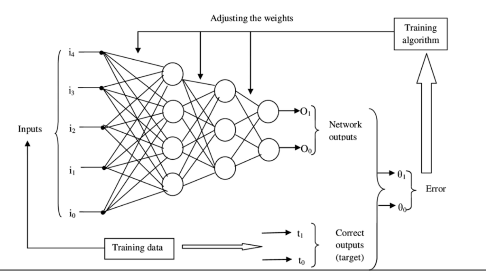
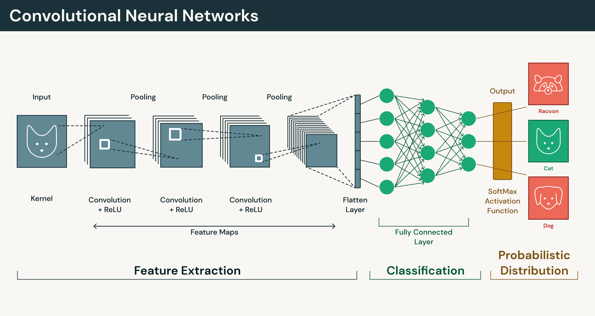
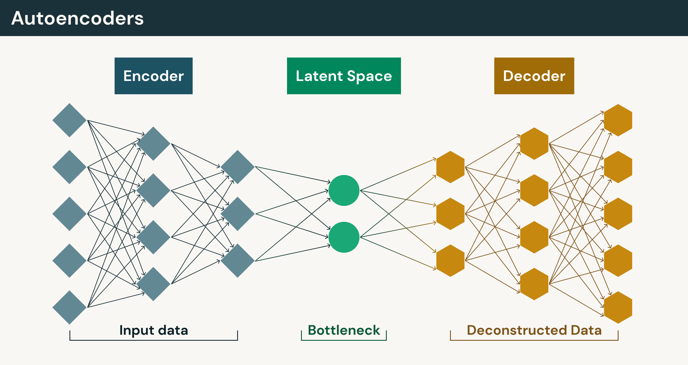

# DEEP LEARNING 101

## Overview of Deep Learning

* Fundamentals
* Applications & Scenerios of used for
* Detailed Theoretical Learning

---

### What Is The Deep Learning ?

_The Deep Learning,  is a specialized subset of machine learning and artificial intelligence that uses multi-layered artificial neural networks to mimic the human brain’s processing of information._

---

### How Does Deep Learning Work ? 

DL works like a human brain therefore,The term "deep" refers to the numerous layers of interconnected nodes (neurons) within these deep neural networks, which process data hierarchically to solve sophisticated tasks.

   

### Artificial Neuron 

_The design of the artificial neuron was inspired by biological neural circuitry._

## Artifical Neuron Network 

_A neural network consists of connected units or nodes called artificial neurons, which loosely model the neurons in the brain.These are connected by edges, which model the synapses in the brain. Each artificial neuron receives signals from connected neurons, then processes them and sends a signal to other connected neurons. The "signal" is a real number, and the output of each neuron is computed by some non-linear function of the totality of its inputs, called the activation function. The strength of the signal at each connection is determined by a weight, which adjusts as part of the training process._

* ### Input Layer
    **Each neuron in this layer corresponds to a specific feature in the dataset, such as a pixel value in an image or a variable in a table, simply passing the information to the next layer.**
* ### Hiden Layers
  **Hidden layers sit between the input and output layers and perform the complex computations that allow the network to learn patterns. These layers transform input data into meaningful representations using weighted sums, bias terms, and activation functions like ReLU or Sigmoid. A network with multiple hidden layers is often referred to as a deep neural network, capable of learning hierarchical abstractions.**
* ### Output Layer
  **The output layer is the final stage that produces the model’s predictions or classifications. The number of neurons in this layer depends on the task; for example, it may have one neuron for regression, two for binary classification, or multiple neurons for multi-class classification using functions like Softmax.**

### How Is It Work ?

**Input data: The model processes training data such as images, text or audio.
Prediction: The network generates an output or prediction.
Error calculation: The prediction is compared to the correct answer and the difference is measured as a loss.
Parameter updates: The model adjusts its internal parameters to reduce that error.Deep learning networks can contain millions or even billions of parameters, making it impossible to manually determine how each connection contributes to prediction errors. Instead, training relies on mathematical optimization techniques such as backpropagation and gradient descent to determine how the model's parameters should be updated.**

## Convolutional neural networks (CNNs)

**CNNs are deep learning models designed to process visual and spatial data. They are widely used in computer vision tasks such as image classification, object detection and image segmentation.
CNNs analyze images using convolutional layers that scan small regions to detect patterns. Instead of treating every pixel independently, the network learns visual features such as edges, shapes and textures. Early layers capture simple patterns, while deeper layers combine those signals into more complex representations. This ability to learn hierarchical visual features makes CNNs well suited for tasks such as medical imaging systems that detect tumors, facial recognition for identity verification and autonomous driving systems that interpret road conditions and obstacles.**

## Recurrent neural networks (RNNs)

**RNNs are deep learning models designed to process sequential data, where the order of information matters. They are commonly used for tasks involving time series, speech and natural language text. Unlike feedforward neural networks, which treat each input independently, RNNs process inputs step by step so earlier outputs influence how the model interprets later inputs.**

## Diffusion models

**Diffusion models are a class of generative deep learning models that produce realistic outputs — most commonly images — by learning how to remove noise from data.**

**Diffusion models use a two-part framework: a predefined forward process that gradually adds noise, and a learned reverse process that removes noise:**

* Noise addition: Gaussian noise is gradually added to training examples over multiple steps until the original signal becomes nearly indistinguishable from random noise.
* Noise removal: The model learns to reverse this process by predicting how to progressively remove noise and reconstruct the original data.

**Once trained, diffusion models generate new outputs by starting with pure random noise and repeatedly applying the learned denoising process. Each step gradually transforms the noisy input into a more structured and realistic sample. The iterative approach has proven highly effective for generating high-quality images and forms the foundation of many modern generative AI systems. Compared with earlier techniques such as GANs, diffusion models often provide more stable training and more consistent output quality.**

**Graph neural networks
Graph neural networks (GNNs) are deep learning models designed to work with graph-structured data, where information is represented as nodes (entities) connected by edges (relationships). Unlike traditional deep learning models that process structured formats such as image grids or text sequences, graphs represent data as networks of interconnected elements. GNNs are especially useful for problems where understanding relationships between entities is more important than analyzing individual data points.**

**GNNs learn by passing information between connected nodes so each node can update its representation using both its own attributes and information from neighboring nodes. By capturing both direct and indirect connections across a network, GNNs allow machine learning systems to reason about complex relationships and patterns.**