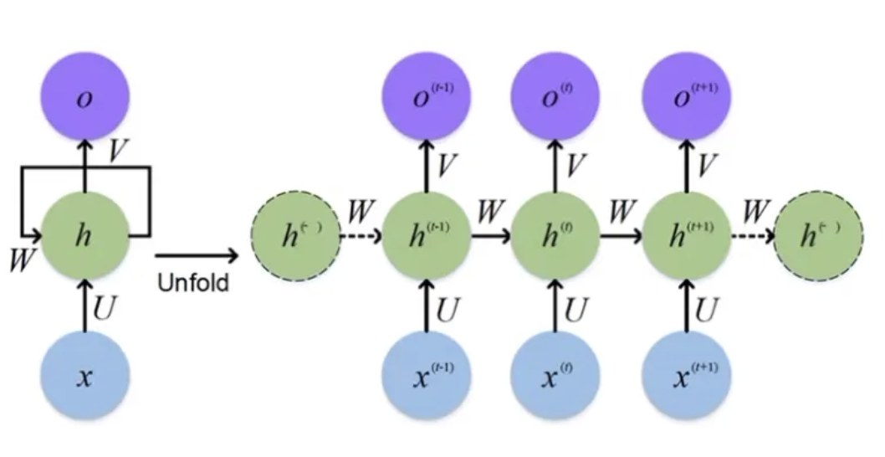
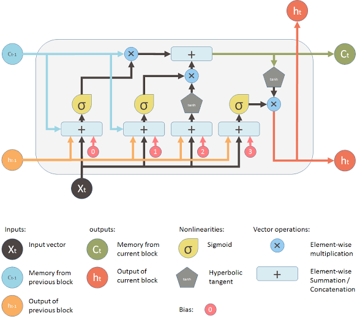
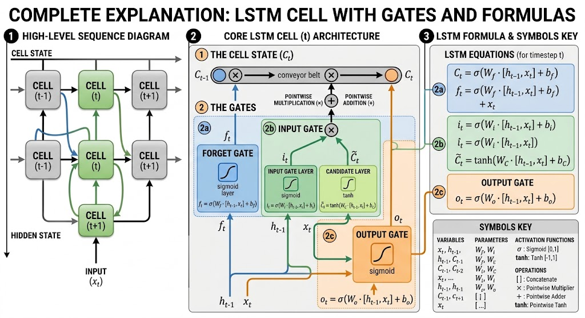
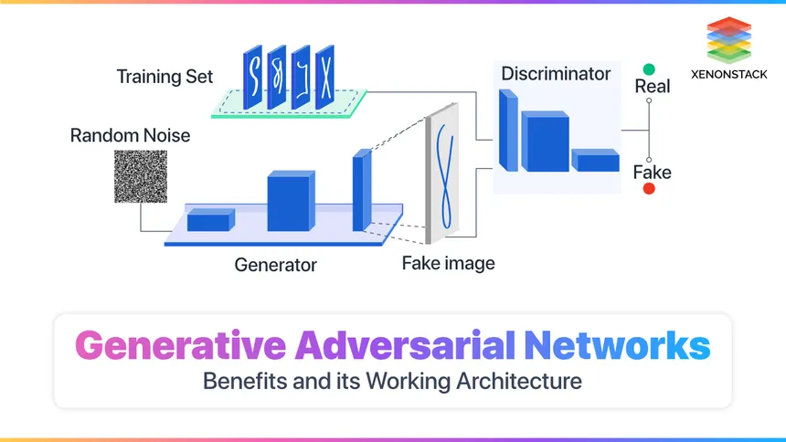
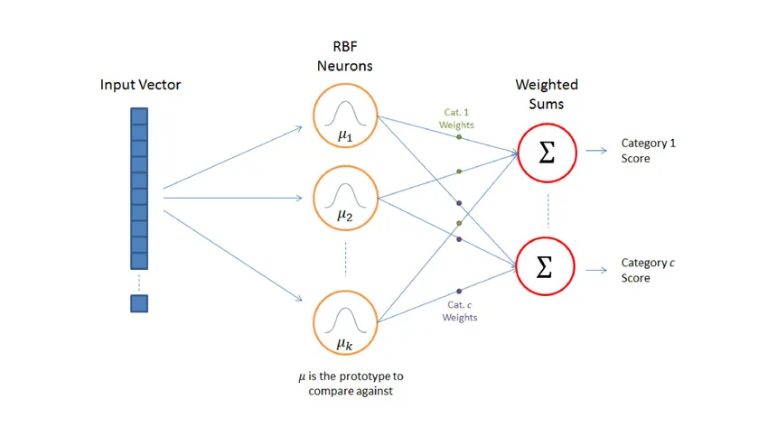
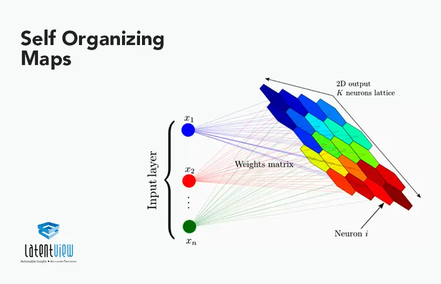

# DEEP LEARNING 101

## Overview of Deep Learning

* Fundamentals
* Applications & Scenerios of used for
* Detailed Theoretical Learning

---

### What Is The Deep Learning ?

_The Deep Learning,  is a specialized subset of machine learning and artificial intelligence that uses multi-layered artificial neural networks to mimic the human brain’s processing of information._

---

### How Does Deep Learning Work ? 

DL works like a human brain therefore,The term "deep" refers to the numerous layers of interconnected nodes (neurons) within these deep neural networks, which process data hierarchically to solve sophisticated tasks.

   

### Artificial Neuron 

_The design of the artificial neuron was inspired by biological neural circuitry._

## Artifical Neuron Network 

_A neural network consists of connected units or nodes called artificial neurons, which loosely model the neurons in the brain.These are connected by edges, which model the synapses in the brain. Each artificial neuron receives signals from connected neurons, then processes them and sends a signal to other connected neurons. The "signal" is a real number, and the output of each neuron is computed by some non-linear function of the totality of its inputs, called the activation function. The strength of the signal at each connection is determined by a weight, which adjusts as part of the training process._

* ### Input Layer
    **Each neuron in this layer corresponds to a specific feature in the dataset, such as a pixel value in an image or a variable in a table, simply passing the information to the next layer.**
* ### Hiden Layers
  **Hidden layers sit between the input and output layers and perform the complex computations that allow the network to learn patterns. These layers transform input data into meaningful representations using weighted sums, bias terms, and activation functions like ReLU or Sigmoid. A network with multiple hidden layers is often referred to as a deep neural network, capable of learning hierarchical abstractions.**
* ### Output Layer
  **The output layer is the final stage that produces the model’s predictions or classifications. The number of neurons in this layer depends on the task; for example, it may have one neuron for regression, two for binary classification, or multiple neurons for multi-class classification using functions like Softmax.**

### How Is It Work ?

**Input data: The model processes training data such as images, text or audio.
Prediction: The network generates an output or prediction.
Error calculation: The prediction is compared to the correct answer and the difference is measured as a loss.
Parameter updates: The model adjusts its internal parameters to reduce that error.Deep learning networks can contain millions or even billions of parameters, making it impossible to manually determine how each connection contributes to prediction errors. Instead, training relies on mathematical optimization techniques such as backpropagation and gradient descent to determine how the model's parameters should be updated.**

## Convolutional neural networks (CNNs)

**CNNs are deep learning models designed to process visual and spatial data. They are widely used in computer vision tasks such as image classification, object detection and image segmentation.
CNNs analyze images using convolutional layers that scan small regions to detect patterns. Instead of treating every pixel independently, the network learns visual features such as edges, shapes and textures. Early layers capture simple patterns, while deeper layers combine those signals into more complex representations. This ability to learn hierarchical visual features makes CNNs well suited for tasks such as medical imaging systems that detect tumors, facial recognition for identity verification and autonomous driving systems that interpret road conditions and obstacles.**

## Recurrent neural networks (RNNs)

**RNNs are deep learning models designed to process sequential data, where the order of information matters. They are commonly used for tasks involving time series, speech and natural language text. Unlike feedforward neural networks, which treat each input independently, RNNs process inputs step by step so earlier outputs influence how the model interprets later inputs.
A key feature of RNNs is the hidden state, which acts as an internal memory that carries information forward through the sequence. This allows the model to capture relationships across time, such as how earlier words influence the meaning of later ones in a sentence. Traditional RNNs can struggle with long sequences because training may suffer from vanishing or exploding gradients, making it difficult to retain information from earlier steps. Architectures such as Long Short-Term Memory (LSTM) networks and Gated Recurrent Units (GRUs) address this limitation by introducing mechanisms that help preserve important information across longer sequences.**

## Long Short-Term Memory (LSTM) 

**A long short-term memory architecture (LSTM) is a special type of recurrent neural network (RNN) designed to learn and remember information over long sequences of data.**  

Imagine you are listening to a very long story. To answer questions at the end, you maintain two things:

* _Your Notebook (Cell State, $C_t$): This holds the most important, long-term facts (e.g., "The main character is John," "John is in Paris")._

* Your Current Train of Thought (Hidden State, $h_t$): What you are actively thinking about right now based on the very last sentence you heard.

**At every new sentence (the Input, $x_t$), you perform three specific actions using your tools: an Eraser, a Pen, and a Highlighter. These are the LSTM's three gates.**

#### The Eraser: The Forget Gate
  * When you hear a new sentence, the first thing you do is check if any of your old notes are obsolete.

  * The Action: You look at your current train of thought and the new sentence.

  * Example: If your notebook says "John is in Paris," and the new sentence is "John boarded a flight to Tokyo," you use your eraser to remove "Paris" from your notebook.

  * In the LSTM: The Forget Gate spits out a number between 0 (completely erase this fact) and 1 (keep this fact completely).

#### The Pen: The Input Gate
* Now that you've erased outdated information, you need to write down the new facts. This takes two steps:

* The Action: First, you decide what is worth writing down (the Input Gate). Second, you actually formulate the new notes you want to add (the candidate values).

* Example: From the sentence "John boarded a flight to Tokyo," you decide "Tokyo" is the important new location. You write "Location = Tokyo" into your notebook.

* In the LSTM: The network creates new potential memories and scales them based on how important they are, then adds them to the Cell State.

#### The Highlighter: The Output Gate
* Finally, the teacher suddenly asks you a question. You need to speak an answer out loud. You don't read your entire notebook; you only read the relevant part.

* The Action: You look at the current question (Input) and decide which part of your updated Notebook (Cell State) you need to highlight and say out loud.

* Example: If the sentence was "He ordered food in Japanese," you highlight "Location = Tokyo" in your notebook, which helps you formulate the thought: "He is speaking Japanese because he is in Tokyo."

* In the LSTM: The Output Gate filters the massive long-term memory (Cell State) down to just the specific information needed for the very next step (the new Hidden State).

### GANs

_Generative Adversarial Networks (GANs) are a deep learning architecture that pits two neural networks against each other to generate highly realistic synthetic data, such as images, text, or audio._

* Instead of explicitly programming a model to create something, you set up a competition where one model learns to create fakes, and the other learns to spot them.

To understand a GAN, imagine a game of cat-and-mouse between an art counterfeiter and a police detective.

#### The Generator (The Counterfeiter)
* The Generator's job is to create fake data that looks perfectly real.

* It starts with random noise (a blank canvas) and produces a sample, like a forged painting.

* It has no direct access to the real data; its only feedback comes from whether the Detective accepted or rejected its forgery.

#### The Discriminator (The Detective)
* The Discriminator's job is to act as a binary classifier, distinguishing between genuine data and the Generator's fakes.

* It looks at both real samples from the training dataset and fake samples from the Generator.

* It outputs a probability score between 0 (completely fake) and 1 (completely real).

#### The Adversarial Training Loop
* The training of a GAN is a simultaneous, two-step "min-max" game.

* Train the Discriminator: You show the Discriminator real data (labeled 1) and fake data from the Generator (labeled 0). It updates its weights to become better at telling them apart, while the Generator's weights are frozen.

* Train the Generator: You have the Generator produce new fakes and pass them to the Discriminator. However, this time, you calculate the loss based on how many fakes the Discriminator incorrectly flagged as real. The Generator updates its weights to make its next batch of fakes even more convincing.

* This process continues until the Generator perfectly matches the true data distribution, leaving the Discriminator completely confused and forced to guess with a 50% accuracy rate.

### Radial Basis Function Networks (RBFNs)

#### The "Real Estate Agent" Analogy

* Instead of abstract math, think of an RBF network as a real estate agent trying to predict the price of a house based strictly on its location on a map.

* Placing Reference Pins (The Centers): The agent doesn't look at the whole map at once. Instead, they place several reference pins on key neighborhoods they know well (the "centers" of the basis functions).

* Measuring Distance: When you ask the agent to price a new house, they measure the exact physical distance from the new house to each of their reference pins.

* Local Influence (The Radial Function): If the new house is right next to Pin A, Pin A has a massive influence on the agent's price guess. If the house is miles away from Pin B, Pin B's influence rapidly drops to zero.

* The Final Estimate (Linear Output): The agent calculates the final price by summing up the weighted influence of all the nearby pins.

##### RBF Network Architecture
* An RBF network typically consists of exactly three layers.
  - The Input Layer: This layer simply receives the data vector and distributes it to the next layer. It performs no calculations.

  - The Hidden Layer (The RBF layer): This is where the unique processing happens. Each neuron in this layer represents a "center" in the data space. When an input arrives, the neuron calculates the Euclidean distance between the input and its center. It then passes that distance through a localized, non-linear function (usually a Gaussian curve).

  - The Output Layer: This layer takes the outputs from all the hidden neurons, multiplies them by a set of weights, and adds them together (a simple linear combination) to produce the final answer.

### Self-Organizing Maps (SOMs) 

_Self-Organizing Maps (SOMs),also known as Kohonen maps, are a type of unsupervised artificial neural network designed to represent complex, high-dimensional data on a low-dimensional (typically 2D) topological grid._

Unlike the supervised classification and regression tasks typically tackled with algorithms like LightGBM or Random Forests, SOMs do not use error backpropagation or target labels. Instead, they rely on competitive learning to cluster data and reduce dimensionality while preserving the geometric relationships of the original dataset.

* A SOM has a remarkably simple structure compared to deep neural networks:

* The Input Layer: A node for every feature in the input vector. It simply feeds the data forward.

* The Output Layer (The Map): A 2D grid of neurons (often arranged in a rectangular or hexagonal lattice).

* Crucial Detail: There are no weights between the input and output nodes in the traditional sense. Instead, each neuron on the 2D grid contains its own internal Weight Vector that has the exact same number of dimensions as the input data.