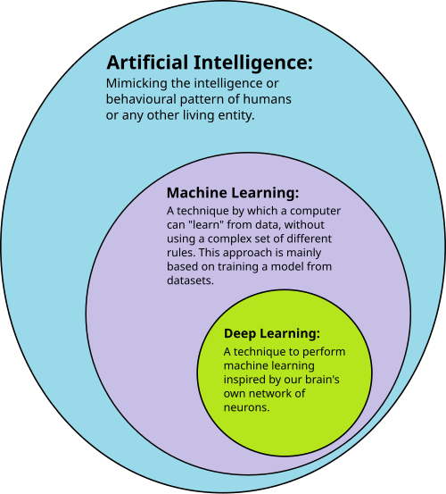
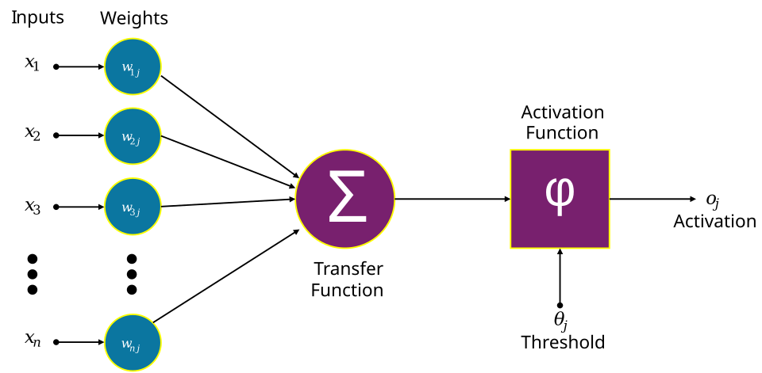
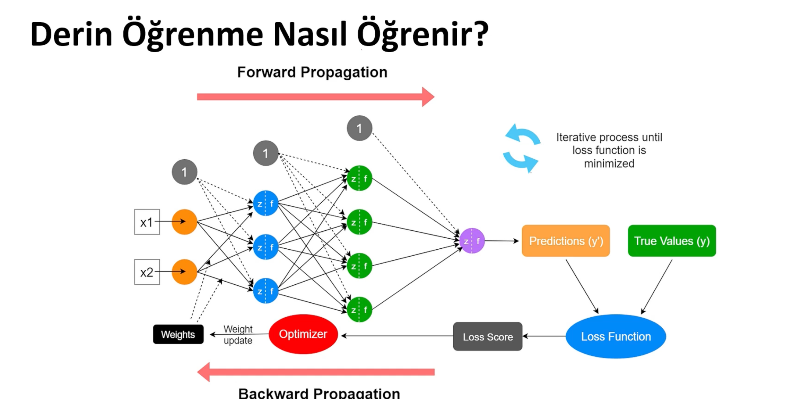

# DEEP LEARNING 101

## Overview of Deep Learning

* Fundamentals
* Applications & Scenerios of used for
* Detailed Theoretical Learning

---

### What Is The Deep Learning ?

_The Deep Learning,  is a specialized subset of machine learning and artificial intelligence that uses multi-layered artificial neural networks to mimic the human brain’s processing of information._

---

### How Does Deep Learning Work ? 

DL works like a human brain therefore,The term "deep" refers to the numerous layers of interconnected nodes (neurons) within these deep neural networks, which process data hierarchically to solve sophisticated tasks.

   

### Artificial Neuron 

   

_The design of the artificial neuron was inspired by biological neural circuitry._

### Artifical Neuron Network 

   

_A neural network consists of connected units or nodes called artificial neurons, which loosely model the neurons in the brain.These are connected by edges, which model the synapses in the brain. Each artificial neuron receives signals from connected neurons, then processes them and sends a signal to other connected neurons. The "signal" is a real number, and the output of each neuron is computed by some non-linear function of the totality of its inputs, called the activation function. The strength of the signal at each connection is determined by a weight, which adjusts as part of the training process._

* ### Input Layer
    **Each neuron in this layer corresponds to a specific feature in the dataset, such as a pixel value in an image or a variable in a table, simply passing the information to the next layer.**
* ### Hiden Layers
  **Hidden layers sit between the input and output layers and perform the complex computations that allow the network to learn patterns. These layers transform input data into meaningful representations using weighted sums, bias terms, and activation functions like ReLU or Sigmoid. A network with multiple hidden layers is often referred to as a deep neural network, capable of learning hierarchical abstractions.**
* ### Output Layer
  **The output layer is the final stage that produces the model’s predictions or classifications. The number of neurons in this layer depends on the task; for example, it may have one neuron for regression, two for binary classification, or multiple neurons for multi-class classification using functions like Softmax.**